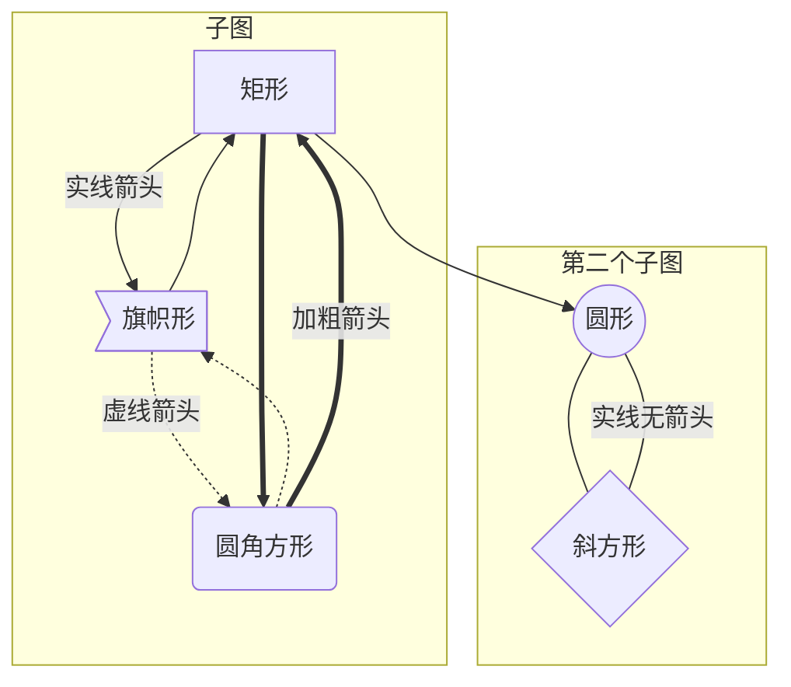

[Cmd Markdown 简明语法手册][1]

[1]: https://www.zybuluo.com/mdeditor

```mermaid  
graph TD  
     subgraph 子图  
     a1[矩形]  
     a2>旗帜形]  
     a3(圆角方形)  
     end  
     subgraph 第二个子图  
     b1((圆形))  
     b2{斜方形}  
     end  
     a1-->|实线箭头|a2  
     a2-->a1  
     a2-.->|虚线箭头|a3  
     a3-.->a2  
     a3==>|加粗箭头|a1  
     a1==>a3  
     b1---b2  
     b2---|实线无箭头|b1  
     a1-->b1  
```  
       